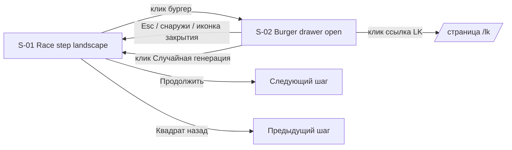

---
tags:
  - note/specific/code
  - category/webdev
aliases:
  - landscape-race-redesign-ui-spec-ru
icon: </>
color: "#ab4642"
created: 2026-06-02T22:00:50+03:00
updated: 2026-06-03T10:53:34+03:00
---

# UI-спецификация редизайна этапа выбора расы (ландшафт)

## Обзор

Данная UI-спецификация адаптирует существующий этап выбора расы в мастере персонажа под новый дизайн из Figma **только для ландшафтного режима телефона** (`@custom-variant nlp` = `orientation: landscape AND max-width: 1279px`). Новый макет использует трёхзонную композицию (слева меню рас, справа панель характеристик, сверху навигация по шагам) с второстепенными элементами управления (Случайная генерация, RoomInfo, ссылка LK, Помощь), свёрнутыми за бургер-меню, прижатое к правому краю. Путь рендеринга — существующий `RaceStep.tsx`, расширенный переопределениями через Tailwind-вариант `nlp:*`; `RaceStepMobile.tsx` не затрагивается, поскольку ландшафт уже маршрутизируется в `RaceStep` (`code: src/app/(game)/game/character/page.tsx:548`, шлюз `dol:flex`).

### Целевой PRD
- Путь PRD: Н/Д — основано на пользовательских требованиях (оркестратор, слушание 2026-06-02) и анализе кодовой базы/UI.
- Объём фичи: Ландшафтная адаптация `RaceStep` плюс новый общий компонент `CharacterBurgerMenu`, переиспользуемый на каждом ландшафтном шаге, начиная с `race` и далее.

### Источник дизайна
| Источник | Путь | Версия |
|----------|------|--------|
| Figma (канонический) | Файл Figma `VCzIT4pfiTiXCMAkHrnpS7`, узел `1147-18670` | Прочитан через Figma MCP 2026-06-02 |
| Код прототипа | — (прототип не предоставлен) | — |

## Управление прототипом

Код прототипа для этой фичи не предоставлен; узел Figma является каноническим визуальным референсом, а этот документ — канонической спецификацией. Директория `docs/ui-spec/assets/` намеренно не создаётся.

## Использованные внешние ресурсы

| Ресурс (метка уровня проекта)  | Идентификатор фичи                                                               | Примечания                                                                                                                                                                                                                |
| ------------------------------ | -------------------------------------------------------------------------------- | ------------------------------------------------------------------------------------------------------------------------------------------------------------------------------------------------------------------------- |
| Источник дизайна — Figma       | Файл `VCzIT4pfiTiXCMAkHrnpS7`, узел `1147-18670` (ландшафтное меню рас, 812×375) | Визуализация открытого состояния бургера НЕ в Figma — предложено в §«Открытые вопросы».                                                                                                                                   |
| Backend API                    | `GET /api/character-builder/races`, `GET /api/character-builder/subraces`        | Уже используется через `useCharacter` → `useCharacterCatalog` (достигается через `src/proxy.ts` редирект на `https://test.dndmaxwell.online` — уже настроено; изменений для этого редизайна не требуется). Без изменений. |
| Инструкции проекта — AGENTS.md | `AGENTS.md` (разделы: структура, цветовые токены, правила адаптивности)          | Источник истины для токенов, шрифтовых классов, структурных правил. PDF-гайдлайн УСТАРЕЛ.                                                                                                                                 |

## Прослеживаемость ПМ (Прототип)

Прототип отсутствует; таблица прослеживаемости ПМ опущена. Требования записаны непосредственно в §«Определение взаимодействия» для каждого компонента ниже, с маркерами `req:` вместо идентификаторов ПМ.

## Список экранов и переходы

### Список экранов

| ID экрана | Название экрана                               | Описание                                                                                            | Условие входа                                                                                                                                  |
| --------- | --------------------------------------------- | --------------------------------------------------------------------------------------------------- | ---------------------------------------------------------------------------------------------------------------------------------------------- |
| S-01      | Мастер персонажа — шаг выбора расы (ландшафт) | Трёхзонная композиция (расы слева / характеристики справа / навигация сверху) + триггер бургер-меню | `code: page.tsx:548` ветка `dol:flex` с `currentStep === 'race'` и вьюпортом, соответствующим медиа-запросу `nlp` (ландшафт и ширина ≤ 1279px) |
| S-02      | Открытое бургер-меню                          | Выдвижная панель справа с второстепенными элементами управления                                     | Пользователь активирует триггер бургера на S-01 (или на любом последующем ландшафтном шаге ≥ race)                                             |

### Условия переходов

| Источник | Назначение     | Триггер                                                                                                                     | Условие-шлюз                                                                                                                                                                                                                                                                                                                                                                     |
| -------- | -------------- | --------------------------------------------------------------------------------------------------------------------------- | -------------------------------------------------------------------------------------------------------------------------------------------------------------------------------------------------------------------------------------------------------------------------------------------------------------------------------------------------------------------------------- |
| S-01     | S-02           | Клик / `Enter` / `Space` на триггере бургера                                                                                | Активный вьюпорт `nlp`; `currentStep` в `[race, subrace, class, subclass?, origin, alignment, stats, spells]` — то же условие, что и у существующего кластера `code: page.tsx:286,320`. Обоснование: шаги `name` и `gender` имеют отдельные десктопные обёртки и предшествуют кластеру; они никогда не были в шлюзе рендеринга кластера и остаются вне области действия бургера. |
| S-02     | S-01           | `Esc`, клик снаружи, клик по иконке закрытия, клик по внутреннему действию панели (например, ссылка LK запускает навигацию) | Нет                                                                                                                                                                                                                                                                                                                                                                              |
| S-01     | Следующий шаг  | Кнопка `Продолжить` (сохранена из текущего потока `CharacterContinueButton`, `code:` не изменяется)                         | `selection.race` установлен (текущее поведение, без изменений)                                                                                                                                                                                                                                                                                                                   |
| S-01     | Предыдущий шаг | Квадрат "назад" (сохранён из текущей кнопки со стрелкой назад, `code:` не изменяется)                                       | У `currentStep` есть предшественник в `allSteps`                                                                                                                                                                                                                                                                                                                                 |



## Декомпозиция компонентов

### Дерево компонентов

```
CharacterPage (ландшафтная ветка (game)/game/character/page.tsx)
  +-- CharacterStepsNav (существующий, расширенный)
  |   +-- StepCircle x N (существующий внутренний элемент)
  |   +-- BurgerTrigger (НОВЫЙ слот, отрисованный в правом конце навигационной полосы)
  +-- RaceStep (существующий, расширенный)
  |   +-- Панель "РАСА" (слева)
  |   |   +-- Заголовок "РАСА" + CharacterRandomizeButton (только раса, сохранён)
  |   |   +-- RaceTileGrid (4 колонки в nlp; было 3)
  |   |   |   +-- RaceTile x N
  |   |   |       +-- Шестиугольная рамка (Vector1 из Figma — вероятно, переиспользует ClassHalfCircle или новый SVG)
  |   |   |       +-- Иконка расы
  |   |   |       +-- Подпись
  |   |   |       +-- [только выбранный] Чёрная заливка (НОВЫЙ заполненный вариант)
  |   |   +-- Скролл-пилюля (декоративная, правый край)
  |   +-- CharacterRightPanel (существующий, расширенный; RoomInfo удалён в nlp)
  |       +-- Заголовок "Характеристики"
  |       +-- Ряд: портрет + имя + шеврон пола
  |       +-- StatRow x 5 (иконка | разделитель | значение | подпись)
  |       +-- Плашка "Особенности"
  +-- Нижние элементы управления (существующие, без изменений)
  |   +-- Квадрат назад (41×41)
  |   +-- Продолжить (бирюзовый, широкий)
  +-- CharacterBurgerMenu (НОВЫЙ; портальная панель)
      +-- Поверхность панели (выдвижная справа)
      |   +-- Иконка закрытия
      |   +-- CharacterRandomizeAllButton (существующий компонент, переиспользуется без изменений)
      |   +-- CharacterRoomInfo (существующий компонент, переиспользуется без изменений — кеш снимка сохранён)
      |   +-- Ссылка LK (встроенный SVG-якорь на /lk)
      |   +-- Элемент Помощь (встроенный need-help.svg + подсказка; НЕ компонент HelpButton)
      +-- Затемнение фона
```

### Компонент: CharacterStepsNav (расширенный)

Существующий компонент в `code: src/components/sections/character/shared/CharacterStepsNav.tsx:28` — уже осведомлён о `nlp` (`nlp:flex-nowrap nlp:overflow-x-auto nlp:w-6 nlp:h-6 nlp:pt-2`). Расширение является аддитивным: слот для триггера бургера, прижатый к правому краю.

#### Матрица «Состояние × Отображение»

| Состояние   | По умолчанию                                                                                                                                                                                                                                                                                                                                                                                                                                                                                                                      | Загрузка                                        | Пусто | Ошибка                                                                                                                                                                            | Частично                                                                                                                  |
| ----------- | --------------------------------------------------------------------------------------------------------------------------------------------------------------------------------------------------------------------------------------------------------------------------------------------------------------------------------------------------------------------------------------------------------------------------------------------------------------------------------------------------------------------------------- | ----------------------------------------------- | ----- | --------------------------------------------------------------------------------------------------------------------------------------------------------------------------------- | ------------------------------------------------------------------------------------------------------------------------- |
| Отображение | 9 кружков шагов (или 10 с `subclass`, согласно `code: page.tsx:175-193` IIFE `allSteps`), каждый 17×17 в nlp, подпись `Jost 10px` (`ui:` Figma). Активный кружок: рамка `--color-cream-muted` (#FCE9CE), подпись `--color-cream` (#FFEED5). Завершённый кружок: заливка `--color-cream-muted` (предложено; не указано в Figma — см. Открытые вопросы). Триггер бургера отрисовывается после последнего кружка, вертикально отцентрирован, иконка = 3 горизонтальные линии, цвет `--color-cream` (имя ассета в Figma "LightGray"). | Н/П (шаги статичны после разрешения `allSteps`) | Н/П   | Если деривация `allSteps` завершается ошибкой (защитно), отрисовать пустой массив кружков + всё равно отрисовать триггер бургера, чтобы пользователь мог перейти на LK из панели. | Если у шага есть флаг `disabled` (например, `subclass` добавлен позже), отрисовать его кружок затемнённым с `opacity-50`. |

#### Определение взаимодействия

| req: | Условие EARS | Действие пользователя | Реакция системы | Переход состояния | Обработка ошибок |
|------|-------------|----------------------|-----------------|-------------------|------------------|
| req:nav-1 | Когда пользователь кликает по ранее посещённому кружку шага | Клик | Переход на этот шаг | `currentStep` обновляется через существующий обработчик (без изменений) | Отключённые кружки игнорируют клики |
| req:nav-burger-1 | Когда пользователь кликает триггер бургера | Клик / `Enter` / `Space` | Открыть панель (S-01 → S-02), установить фокус на первый фокусируемый элемент в панели | `burgerOpen = true` | Если монтирование панели не удалось, записать в консоль; триггер остаётся видимым |
| req:nav-burger-2 | Пока панель открыта, когда пользователь снова кликает триггер бургера | Клик | Закрыть панель | `burgerOpen = false` | — |
| req:nav-no-clip | Когда навигационная полоса горизонтально прокручивается на самом маленьком ландшафте (568×320) | Горизонтальная прокрутка | Триггер бургера остаётся видимым (липкое позиционирование в правом конце полосы, не является частью прокрутки) | — | Если липкое позиционирование не поддерживается, откатиться к фиксированному триггеру, прижатому к правому краю вьюпорта. |

### Компонент: RaceStep (расширенный)

Существующий компонент в `code: src/components/sections/character/steps/RaceStep.tsx:35`. Свойства (`RaceStepProps`) не изменяются. Вся адаптация — через Tailwind-переопределения `nlp:*` на существующей разметке; новых свойств нет.

#### Матрица «Состояние × Отображение»

| Состояние | По умолчанию | Загрузка | Пусто | Ошибка | Частично |
|-----------|-------------|----------|-------|--------|----------|
| Отображение | Двухзонный макет: левая панель "РАСА" (199×324 при эталонном Figma 812×375, резина через `cqi`), правая панель "Характеристики". Левая панель: `bg-card-gradient` (#121212→#272727), заголовок Firenight `--color-cream` 13.787px, **4-колоночная** сетка рас (было 3, `code: RaceStep.tsx` `grid-cols-3` должно стать `nlp:grid-cols-4`). Каждая плитка: шестиугольная рамка + иконка расы + подпись `Jost 8.628px`. Выбранная плитка: полужирная подпись Firenight + заливка "Black" (`ui:` Группа 1147:18866). | Пока `raceOptions` пуст И `useCharacterCatalog` сообщает о загрузке: отрисовать 8 скелетных шестиугольных плиток (`bg-surface-light/30 animate-pulse`). | Если `raceOptions.length === 0` после загрузки: отрисовать сообщение "Расы не загружены" + CTA для повтора, подключённый к `refetch` (существующий). | Если `useCharacterCatalog` сообщает об ошибке: отрисовать баннер ошибки внутри левой панели + CTA для повтора. | Если `raceOptions` загружены частично (редко; только если бэкенд вернул усечённый список): отрисовать доступное, без специального UI. |

##### Левая панель — RaceTileGrid

- Ширина: `clamp(264px, container query, 421px)` сохранена (`code:` существующий cqi-размер).
- Сетка: `nlp:grid-cols-4` (эталон Figma) переопределяет существующую `grid-cols-3`. Соотношение сторон плиток сохранено; общая высота сетки регулируется.
- Выбранное состояние плитки требует **заполненного варианта** шестиугольного/полукруглого SVG (заливка "Black" в Figma). `code: src/components/ui/character/ClassHalfCircle.tsx` может потребовать новый булев проп `filled`, ИЛИ можно ввести родственный SVG-ассет. Решение откладывается до Design Doc (см. Открытые вопросы TBD-01).
- Скролл: вертикальная прокрутка внутри левой панели; декоративная скролл-пилюля на правом краю (`ui:` Figma) отражает позицию прокрутки. Пилюля чисто декоративная — фактическая прокрутка осуществляется контейнером через `overflow-y: auto`.
- Ряд заголовка сохраняет `CharacterRandomizeButton` (рандом только расы); `CharacterRandomizeAllButton` **удалён** из верхней части левой панели в `nlp` (перенесён в бургер).

##### Правая панель — см. CharacterRightPanel ниже.

#### Определение взаимодействия

| req: | Условие EARS | Действие пользователя | Реакция системы | Переход состояния | Обработка ошибок |
|------|-------------|----------------------|-----------------|-------------------|------------------|
| req:race-1 | Когда плитка расы кликнута | Клик / `Enter` / `Space` при фокусе на плитке | Вызвать `onSelectRace(option)` (существующий обработчик) | `selection.race` обновлён; подраса очищена согласно существующему каскадному эффекту `useCharacter` | Если выбор не удался (сеть), показать тост через существующий `ToastContext` |
| req:race-2 | Когда кликнута кнопка рандома только для расы | Клик | Вызвать `onRandomize()` (существующий) | `selection.race` установлен на случайный вариант | — |
| req:race-3 | Когда пользователь открывает бургер и кликает Случайная генерация | (рассматривается во взаимодействиях бургера) | — | — | — |
| req:race-4 | Когда `raceOptions` пуст после загрузки | — | Показать пустое состояние с CTA для повтора | Пустое состояние видимо | Повтор вызывает `refetch` из `useCharacterCatalog` |

### Компонент: CharacterRightPanel (расширенный)

Существующий компонент в `code: src/components/sections/character/shared/CharacterRightPanel.tsx:27`. Уже имеет ~25 переопределений `nlp:*`. Два конкретных изменения в этом редизайне:

1. **Существующее встроенное размещение `CharacterRoomInfo` остаётся; его `nlp:hidden!` уже предотвращает дублирование в ландшафте. Новое размещение добавлено внутри `CharacterBurgerMenu`.** Существующий исходный код монтирует `CharacterRoomInfo` под `md:max-[1660px]:flex nlp:hidden!` — этот блок остаётся нетронутым (селектор `nlp:hidden!` надёжно скрывает его в ландшафте, поэтому встроенная копия НЕ дублируется визуально, когда бургер отображает новое размещение). Второй `CharacterRoomInfo` монтируется как постоянный дочерний элемент нового поддерева панели `CharacterBurgerMenu`. Поскольку `CharacterRoomInfo` использует кешированный модулем снимок `useSyncExternalStore`, два одновременных монтирования используют один и тот же снимок и не вызывают расходящегося состояния.
2. **Перекалибровать `clamp()` для `--panel-h`** до целевой высоты ~324px при эталонной Figma (812×375). Текущее значение `clamp()` неизвестно этой спецификации — Design Doc должен проверить существующий CSS и предложить новое выражение `clamp()`.

#### Матрица «Состояние × Отображение»

| Состояние | По умолчанию | Загрузка | Пусто | Ошибка | Частично |
|-----------|-------------|----------|-------|--------|----------|
| Отображение | `bg-card-gradient`. Заголовок "Характеристики" Firenight `--color-cream` 12.532px. Ряд: портрет + имя + шеврон пола. Пять рядов характеристик: `[иконка | разделитель | значение 00 Firenight 12.821px | подпись Jost 8.547px]`. Ряд Ловкость несёт звёздочку (`ui:` Figma). Плашка "Особенности" снизу с полужирными подписями Оружие / Броня / Навыки. | Когда `useCharacter` `loading` истинно и выбор пуст: отрисовать заполнители "—" в значениях характеристик; портрет показывает нейтральный силуэт. | Когда раса+пол не выбраны, область портрета показывает силуэт-заполнитель (существующее поведение). | Если изображение портрета не загружается, откатиться к силуэту (существующее поведение через `heroImageMap`). | Когда некоторые черты вычислены (например, раса выбрана, но подраса нет), показать частичные модификаторы характеристик (существующее поведение). |

#### Определение взаимодействия

| req: | Условие EARS | Действие пользователя | Реакция системы | Переход состояния | Обработка ошибок |
|------|-------------|----------------------|-----------------|-------------------|------------------|
| req:right-1 | Когда пользователь кликает шеврон пола в ряду портрета | Клик | Переключить пол между `male` / `female` (существующий обработчик) | `selection.gender` переключён | — |
| req:right-2 | Когда модификатор характеристики меняется из-за выбора расы/подрасы | (пассивно) | Значение характеристики перерендерено с комбинированным модификатором из пропа `totalStats` | — | — |

### Компонент: CharacterBurgerMenu (новый)

Новый компонент в `src/components/sections/character/shared/CharacterBurgerMenu.tsx`. Общий для ландшафтных шагов `[race, subrace, class, subclass?, origin, alignment, stats, spells]` — тот же шлюз рендеринга, что и у существующего кластера `code: page.tsx:286,320`. Шаги `name` и `gender` имеют отдельные десктопные обёртки, предшествующие кластеру, и намеренно исключены. Заменяет этот кластер на ландшафтных размерах.

#### Матрица «Состояние × Отображение»

| Состояние   | По умолчанию (закрыто)                                                                                                                               | Открыто                                                                                                                                                                                                                                                                                                                                                                                                                                                                                                                                                                                                                                                                                                                                                                                                             | Загрузка                                                                                                                                                                                                                                                                                                               | Пусто                                                                                                                                                                              | Ошибка                                                                                                                                                                                                                                                                                                                                                            |
| ----------- | ---------------------------------------------------------------------------------------------------------------------------------------------------- | ------------------------------------------------------------------------------------------------------------------------------------------------------------------------------------------------------------------------------------------------------------------------------------------------------------------------------------------------------------------------------------------------------------------------------------------------------------------------------------------------------------------------------------------------------------------------------------------------------------------------------------------------------------------------------------------------------------------------------------------------------------------------------------------------------------------- | ---------------------------------------------------------------------------------------------------------------------------------------------------------------------------------------------------------------------------------------------------------------------------------------------------------------------- | ---------------------------------------------------------------------------------------------------------------------------------------------------------------------------------- | ----------------------------------------------------------------------------------------------------------------------------------------------------------------------------------------------------------------------------------------------------------------------------------------------------------------------------------------------------------------- |
| Отображение | Виден только триггер бургера (отрисовывается внутри `CharacterStepsNav`). Триггер: 3 горизонтальные линии, цвет `--color-cream`, цель-хит ≥ 24×24px. | Выдвижная панель заезжает справа (визуализация открытого состояния не указана в Figma — предложено: поверхность `bg-card-gradient`, ширина `~280px`, полная высота ландшафтного вьюпорта, декоративная SVG-рамка в стиле `MobileStepFrame`). Содержимое выстроено вертикально с отступами `--spacing-md`: иконка закрытия (справа сверху) → `CharacterRandomizeAllButton` → `CharacterRoomInfo` → ряд ссылки LK → ряд элемента Помощь. Затемнение: `rgba(0,0,0,0.4)`. **`CharacterRoomInfo` монтируется как постоянный дочерний элемент поддерева панели (отрисовывается, даже когда панель закрыта, скрыт через CSS на поверхности панели), чтобы кешированный модулем снимок `useSyncExternalStore` был установлен один раз при первом монтировании и переживал циклы открытия/закрытия без повторной подписки.** | Если снимок `CharacterRoomInfo` всё ещё разрешается (первый рендер), виджет показывает своё существующее внутреннее состояние загрузки. НЕ оборачивать дополнительным загрузчиком (кешированный модулем снимок `useSyncExternalStore` должен оставаться единственным источником истины, согласно ограничению `code:`). | Если пользователь не аутентифицирован (нет комнаты): `CharacterRoomInfo` отрисовывает своё собственное пустое состояние. Ссылка LK, Помощь, Случайная генерация остаются видимыми. | Если целевой портал отсутствует, отрисовать панель встроенно (без портала) как непортализированное наложение с `position: fixed` — деградирует элегантно, а не отключает триггер. Записать предупреждение в консоль. Это сохраняет доступ к LK при ошибке портала (согласуется с колонкой Error для `CharacterStepsNav`, которая держит триггер бургера видимым). |

#### Определение взаимодействия

| req:                     | Условие EARS                                                       | Действие пользователя                | Реакция системы                                                                                                                                                                                                                                                                                                                                                                                                                                                                                   | Переход состояния                                                                                                                        | Обработка ошибок                                                                                      |
| ------------------------ | ------------------------------------------------------------------ | ------------------------------------ | ------------------------------------------------------------------------------------------------------------------------------------------------------------------------------------------------------------------------------------------------------------------------------------------------------------------------------------------------------------------------------------------------------------------------------------------------------------------------------------------------- | ---------------------------------------------------------------------------------------------------------------------------------------- | ----------------------------------------------------------------------------------------------------- |
| req:burger-open          | Когда закрыто и триггер активирован                                | Клик / `Enter` / `Space` на триггере | Панель заезжает (анимация ~200мс, prefers-reduced-motion = мгновенно). Фокус перемещается на иконку закрытия. Прокрутка тела заблокирована.                                                                                                                                                                                                                                                                                                                                                       | `burgerOpen: false → true`                                                                                                               | —                                                                                                     |
| req:burger-close-esc     | Когда открыто и нажат `Esc`                                        | Клавиша `Esc` вниз                   | Панель выезжает, фокус возвращается на триггер бургера                                                                                                                                                                                                                                                                                                                                                                                                                                            | `burgerOpen: true → false`                                                                                                               | —                                                                                                     |
| req:burger-close-outside | Когда открыто и клик снаружи панели (по затемнению)                | Клик                                 | Панель выезжает                                                                                                                                                                                                                                                                                                                                                                                                                                                                                   | `burgerOpen: true → false`                                                                                                               | Переиспользует паттерн клика снаружи `nlpHelpRef` (`code:` существующий).                             |
| req:burger-close-icon    | Когда открыто и кликнута иконка закрытия                           | Клик                                 | Панель выезжает                                                                                                                                                                                                                                                                                                                                                                                                                                                                                   | `burgerOpen: true → false`                                                                                                               | —                                                                                                     |
| req:burger-randomize-all | Когда открыто и кликнут "Случайная генерация"                      | Клик                                 | Вызвать `useCharacterRandomizer.randomizeCharacter()` (существующий). **Предложенное поведение по умолчанию: панель закрывается после случайной генерации, чтобы показать новый выбор; подтвердить с владельцем дизайна.**                                                                                                                                                                                                                                                                        | `burgerOpen → false` (при условии подтверждения дизайна); выбор каскадируется через существующие ссылки `pendingSubRace/SubClass/Spells` | Если рандомайзер выдаёт ошибку, записать в лог + тост через `ToastContext`; панель остаётся открытой. |
| req:burger-roominfo      | Когда открыто и пользователь взаимодействует с виджетом RoomInfo   | (делегировано)                       | `CharacterRoomInfo` обрабатывает свои собственные взаимодействия (копировать код комнаты, копировать пароль и т.д., согласно существующей реализации)                                                                                                                                                                                                                                                                                                                                             | —                                                                                                                                        | —                                                                                                     |
| req:burger-lk            | Когда открыто и пользователь кликает ссылку LK                     | Клик / `Enter`                       | Переход на `/lk` (Next.js `<Link href="/lk">`)                                                                                                                                                                                                                                                                                                                                                                                                                                                    | Панель закрывается неявно при смене маршрута                                                                                             | —                                                                                                     |
| req:burger-help          | Когда открыто и пользователь наводит/фокусирует иконку Помощи      | Наведение / фокус                    | Показать подсказку с текстом помощи (встроенный SVG + локальный слушатель, НЕ компонент `HelpButton`). Обоснование: `HelpButton` прикрепляет слушатель `mousedown` на уровне документа для закрытия по клику снаружи; монтирование двух экземпляров (один в старом кластере, один в панели) прикрепляет два слушателя, которые перекрёстно срабатывают и ломают поведение переключения подсказки. Поэтому панель использует встроенный SVG + локальный слушатель, ограниченный поддеревом панели. | —                                                                                                                                        | —                                                                                                     |
| req:burger-focus-trap    | Когда открыто                                                      | `Tab` / `Shift+Tab`                  | Фокус циклически перемещается только внутри содержимого панели                                                                                                                                                                                                                                                                                                                                                                                                                                    | —                                                                                                                                        | —                                                                                                     |
| req:burger-step-persist  | Когда пользователь переходит на следующий шаг, пока панель открыта | (защитно)                            | Панель auto-закрывается при смене шага; триггер бургера остаётся в навигации                                                                                                                                                                                                                                                                                                                                                                                                                      | `burgerOpen → false`                                                                                                                     | —                                                                                                     |

### Индекс требований

Каждый маркер `req:*`, использованный в таблицах взаимодействия выше, с однострочным резюме. Design Doc и План работ ссылаются на них как на идентификаторы ПМ.

| req: | Компонент | Резюме |
|------|-----------|--------|
| req:nav-1 | CharacterStepsNav | Клик по ранее посещённому кружку шага переходит на этот шаг. |
| req:nav-burger-1 | CharacterStepsNav | Клик по триггеру бургера открывает панель и перемещает фокус на иконку закрытия. |
| req:nav-burger-2 | CharacterStepsNav | Повторный клик по триггеру бургера, пока открыто, закрывает панель. |
| req:nav-no-clip | CharacterStepsNav | Триггер бургера остаётся во вьюпорте при 568×320, даже когда полоса навигации горизонтально прокручена. |
| req:race-1 | RaceStep | Клик по плитке расы выбирает расу; подраса очищается согласно каскадному эффекту. |
| req:race-2 | RaceStep | Клик по кнопке рандома только расы устанавливает случайную расу. |
| req:race-3 | RaceStep | Перекрёстная ссылка: Случайная генерация вызывается из бургера (см. req:burger-randomize-all). |
| req:race-4 | RaceStep | Пустой список рас показывает пустое состояние с CTA для повтора. |
| req:right-1 | CharacterRightPanel | Клик по шеврону пола переключает пол. |
| req:right-2 | CharacterRightPanel | Значения характеристик перерендериваются при изменении модификаторов расы/подрасы. |
| req:burger-open | CharacterBurgerMenu | Активация триггера открывает панель с фокусом на иконке закрытия и блокировкой прокрутки тела. |
| req:burger-close-esc | CharacterBurgerMenu | Esc закрывает панель и возвращает фокус на триггер. |
| req:burger-close-outside | CharacterBurgerMenu | Клик по затемнению закрывает панель. |
| req:burger-close-icon | CharacterBurgerMenu | Иконка закрытия закрывает панель. |
| req:burger-randomize-all | CharacterBurgerMenu | Случайная генерация запускает существующий рандомайзер; панель закрывается по предложенному умолчанию (TBD-10). |
| req:burger-roominfo | CharacterBurgerMenu | Внутренности RoomInfo делегированы существующему виджету. |
| req:burger-lk | CharacterBurgerMenu | Ссылка LK ведёт на `/lk`. |
| req:burger-help | CharacterBurgerMenu | Иконка Помощи показывает подсказку через встроенный SVG + локальный слушатель (НЕ `HelpButton`). |
| req:burger-focus-trap | CharacterBurgerMenu | Tab / Shift+Tab циклически перемещает фокус только внутри панели. |
| req:burger-step-persist | CharacterBurgerMenu | Панель auto-закрывается, если текущий шаг меняется, пока она открыта. |

## Дизайн-токены и карта компонентов

### Ограничения окружения

- Целевые браузеры: Chrome / Firefox / Safari / Edge — последние 2 версии (согласно нефункциональным требованиям AGENTS.md).
- Поддержка тем: Проект использует единый набор токенов тёмной темы (`--color-deep-bg`, `--color-cream` и т.д.). Переключателя темы нет.
- Container queries: мастер рас использует единицы `cqi` внутри областей контейнеров (`code:` согласно AGENTS.md §«Конвенции»). Новая панель бургера — порталированное наложение → использовать `vw / vh / px`, не `cqi`.

#### Адаптивность

| Брейкпоинт | Ширина × Высота | Ключевые изменения |
|-----------|----------------|-------------------|
| Ландшафт минимальный | 568×320 | Верхняя навигационная полоса горизонтально прокручиваема; триггер бургера липкий в правом конце полосы. Левая панель рас сжимается до своего `cqi`-минимума (~264px). Правая панель сжимается до своего минимума. Ширина панели = `min(280px, 80vw)`. |
| Ландшафт эталон Figma | 812×375 | Все зоны в размерах, заданных Figma. Левая панель 199 × 324 (px-эквивалент при этом вьюпорте через `cqi`). Правая панель высотой 324px. Ширина панели = 280px. |
| Ландшафт верхняя граница | 1279×500 | Макет всё ещё в варианте `nlp`. Все зоны в верхних значениях `clamp()` (левая панель ~421px шириной). Ширина панели = 280px. |
| Десктоп ≥ 1280 | любая | Вариант `nlp` неактивен — десктопный макет нетронут, изменений в поведении нет. |
| Портретный телефон | любая | Маршрутизируется на `RaceStepMobile.tsx` (embla carousel) — не затрагивается. |

### Карта переиспользования существующих компонентов

| UI-элемент | Решение | Существующий компонент | Примечания |
|------------|---------|----------------------|------------|
| Верхняя навигация по шагам | Расширить | `code: components/sections/character/shared/CharacterStepsNav.tsx` | Добавить слот триггера бургера в правом конце; сохранить динамический `allSteps`. |
| Контейнер шага расы | Расширить | `code: components/sections/character/steps/RaceStep.tsx` | Применить переопределения `nlp:*`: `grid-cols-4`, заливка выбранной плитки, удалить `CharacterRandomizeAllButton` из ряда заголовка. |
| Правая панель характеристик | Расширить | `code: components/sections/character/shared/CharacterRightPanel.tsx` | Оставить существующее встроенное размещение `CharacterRoomInfo` нетронутым (уже скрыто в ландшафте через `nlp:hidden!`); перекалибровать `clamp()` для `--panel-h`. |
| Рандом только расы | Переиспользовать | `code: components/ui/character/CharacterRandomizeButton.tsx` | Остаётся в ряду заголовка "РАСА". |
| Случайная генерация | Переиспользовать (перемещён) | `code: components/ui/character/CharacterRandomizeAllButton.tsx` | Перемещён из верхней части левой панели внутрь панели бургера; сам компонент без изменений. |
| Информация о комнате | Переиспользовать (добавить новое размещение) | `code: components/sections/character/shared/CharacterRoomInfo.tsx` | Добавить новое размещение внутри поддерева панели `CharacterBurgerMenu` (существующее встроенное размещение в `CharacterRightPanel` остаётся на месте — `nlp:hidden!` предотвращает дублирование в ландшафте). Кешированный модулем снимок `useSyncExternalStore` общий для обоих размещений (НЕ оборачивать заново). |
| Ссылка LK | Новый (встроенный) | — | Встроенный SVG-якорь внутри бургера; использует Next.js `<Link href="/lk">`. Не вынесен в отдельный компонент (единственное место вызова). |
| Иконка Помощи + подсказка | Новый (встроенный) | — | Встроенный `need-help.svg` + подсказка внутри бургера с локальным слушателем, ограниченным поддеревом панели. **НЕ** компонент `HelpButton`: `HelpButton` прикрепляет слушатель `mousedown` на уровне документа для закрытия по клику снаружи; монтирование двух экземпляров `HelpButton` (например, один в унаследованном кластере и один в панели во время переходного состояния) прикрепляет два слушателя, которые перекрёстно срабатывают и ломают поведение переключения подсказки. Встроенный SVG + локальный слушатель избегает целого класса таких ошибок. |
| Шестиугольная плитка расы (заполненный вариант) | Расширить | `code: components/ui/character/ClassHalfCircle.tsx` (кандидат) | Либо добавить булев проп `filled`, либо ввести родственный SVG. Решение откладывается до Design Doc (Открытые вопросы TBD-01). |
| Поверхность панели бургера | Новый | — | `src/components/sections/character/shared/CharacterBurgerMenu.tsx`. В кодовой базе нет прецедентов выдвижных панелей (`code:` согласно codebase-analyzer). |
| Квадрат назад / Продолжить | Переиспользовать | Существующие кнопки в `RaceStep` / внизу страницы | Без изменений; z-index сохранён на ≥ 100. |
| Существующий nlp-кластер (`code: page.tsx:285-345`) | Удалить | — | Заменён на `CharacterBurgerMenu`. Конкретно: весь блок `<div ref={nlpHelpRef} className="hidden nlp:flex ...">` на строках 285-312 И блок `<div className="hidden nlp:flex fixed z-30 right-2 top-2">` на строках 338-343 удаляются. Паттерн клика снаружи `nlpHelpRef` перемещается в `CharacterBurgerMenu`. Без этого удаления элементы управления будут отрендерены дважды (один раз в старом кластере, один раз внутри бургера). |

### Дизайн-токены

#### Цветовые роли

| Роль | Токен | Значение | Использование |
|------|-------|----------|--------------|
| Фон страницы | `--color-deep-bg` | `#020106` | Внешний фон страницы в ландшафте (фрейм Figma использует `#181818` — замена токена принята согласно примечанию `ui:`). |
| Поверхность карточки | `bg-card-gradient` | `#121212 → #272727` | Левая панель рас, правая панель характеристик, поверхность панели бургера. |
| Поверхность карточки (альт) | `--color-page-bg` | `#1a1a1a` | Альтернативная поверхность; не используется в этом редизайне, но доступна. |
| Заголовки | `--color-cream` | `#FFEED5` | Заголовки Firenight: "РАСА", "Характеристики", "Особенности", подпись активного шага, подпись выбранной плитки. |
| Заголовки (приглушённый акцент) | `--color-cream-muted` | `#FCE9CE` | Рамка активного кружка шага; заливка завершённого шага (предложено). |
| Основной текст | `--color-text-on-dark` | (согласно `globals.css`) | Подписи плиток, подписи характеристик. |
| Акцент / основная CTA | `--color-accent` | `#66AAA5` | Фон кнопки "Продолжить". |
| Граница / разделитель | `--color-divider` + `bg-divider-gradient` | (согласно `globals.css`) | Разделители рядов характеристик. |
| Мягкая поверхность (кружки) | НЕТ существующего токена | `rgba(255,255,255,0.10)` | Заливка кружка шага (по умолчанию). **Предложение:** ввести `--color-surface-soft` = `rgba(255,255,255,0.10)`. См. Открытые вопросы TBD-02. |
| Мягкая граница (кружки) | НЕТ существующего токена | `rgba(255,255,255,0.20)` | Рамка кружка шага (по умолчанию). **Предложение:** ввести `--color-border-soft` = `rgba(255,255,255,0.20)`. См. Открытые вопросы TBD-02. |
| Затемнение панели | НЕТ существующего токена | `rgba(0,0,0,0.4)` | Затемнение фона панели бургера. Встроенное значение приемлемо; не переиспользуемый токен. |

> Старая индиго-палитра (`#6366F1`, `#4F46E5`, `#2563EB`) запрещена AGENTS.md и не вводится нигде в этой спецификации.

#### Иерархия типографики

| Роль | Шрифт | Размер (Figma) | Насыщенность | Примечания |
|------|-------|-----------------|--------------|-----------|
| Заголовок (панель) | Firenight | 13.787px (РАСА), 12.532px (Характеристики), 12.821px (значение характеристики 00) | Regular | Класс `font-firenight`. Размеры относительны контейнеру; значения `clamp()` для ландшафта в Design Doc. |
| Подпись плитки (по умолчанию) | Jost | 8.628px | Regular | `font-jost`. |
| Подпись плитки (выбранная) | Firenight | 8.628px | Bold | `font-firenight font-bold`. |
| Подпись кружка шага | Jost | 10px | Regular | `font-jost`. |
| Подпись характеристики | Jost | 8.547px | Regular | `font-jost`. |
| Полужирные встроенные подписи в "Особенности" | Jost | наследуется | Bold | Оружие / Броня / Навыки. |

> **Clamp-выражения.** Design Doc должен вывести выражения `clamp()` для всех перечисленных размеров шрифта (`13.787px`, `12.532px`, `12.821px`, `8.628px`, `8.547px`, `10px`), чтобы они масштабировались согласованно в `cqi` в своих областях контейнера. Черновое предложение для подписей плиток: `clamp(8px, 1.05cqi, 9px)` — Design Doc должен проверить на четырёх золотых состояниях. См. Открытые вопросы TBD-09.

#### Шкала отступов

Проект не экспортирует явные токены отступов; отступы применяются через Tailwind-утилиты. Для этого редизайна использовать:

| Токен (Tailwind) | Приблизительное значение | Использование |
|------------------|-------------------------|---------------|
| `gap-1` / `gap-2` | 4–8px | Внутреннее содержимое плиток, промежуток между кружками навигации |
| `gap-3` | 12px | Внутреннее расстояние в рядах характеристик |
| `p-2` / `p-3` | 8–12px | Отступы панелей, отступы элементов панели |
| `p-4` | 16px | Внешний отступ панели |

#### Высота (Глубина)

| Уровень | Оформление | Использование |
|---------|-----------|---------------|
| 0 | плоский | Панели, плитки |
| 1 | тонкая внутренняя рамка (существующие декоративные SVG-рамки) | Рамки панелей |
| 3 | `0 8px 24px rgba(0,0,0,0.45)` | Панель бургера (наложение) |

#### Шкала радиусов границ

| Токен | Значение | Использование |
|-------|---------|---------------|
| `rounded-full` | полностью | Кружки шагов, скролл-пилюля, шестиугольная плитка расы (эффективно шестиугольник через SVG) |
| `rounded-md` | 6–8px | Контейнер панели бургера, CTA "Продолжить", квадрат назад |

## Визуальная приёмка

### Золотые состояния

1. **Этап выбора расы в ландшафте по умолчанию (S-01, раса не выбрана)** — Верхняя навигация показывает все кружки шагов + бургер; левая панель показывает сетку шестиугольных плиток в 4 колонки, ни одна плитка не залита; правая панель показывает силуэт-заполнитель и "—" характеристики; "Продолжить" отключена.
2. **Раса выбрана, панель закрыта** — Выбранная плитка показывает полужирную подпись Firenight + заливку "Black"; правая панель показывает портрет + применённые модификаторы характеристик; "Продолжить" активна.
3. **Панель открыта (S-02)** — Панель заезжает справа; затемнение затемняет фон до ~40%; фокус на иконке закрытия; панель содержит сверху вниз: иконку закрытия, кнопку Случайная генерация, виджет RoomInfo, ссылку LK, элемент Помощь.
4. **Минимальный ландшафт (568×320)** — Верхняя навигационная полоса горизонтально прокручиваема; триггер бургера липкий справа; левая и правая панели соблюдают свои `cqi`-минимумы; нет горизонтальной прокрутки страницы на body.

### Ограничения макета

- Ширина левой панели: `clamp(264px, container, 421px)` сохранена из существующей реализации.
- Высота правой панели: `clamp()` с целевым значением ~324px при эталоне Figma 812×375 (Design Doc должен указать точное выражение).
- Ширина панели бургера: `min(280px, 80vw)`.
- Z-index панели бургера: ≥ 110 (выше нижнего кластера Назад/Продолжить на z-100).
- Нет горизонтальной прокрутки body при любой поддерживаемой ландшафтной ширине.
- Верхняя навигация НЕ должна обрезать триггер бургера при горизонтальной прокрутке (триггер липкий в правом конце полосы).
- В ландшафте не должно быть плавающего кластера управления справа сверху; второстепенные элементы управления (Случайная генерация, RoomInfo, LK, Помощь) доступны только через панель бургера. Предыдущий nlp-кластер `page.tsx:285-345` не должен рендериться ни в каком ландшафтном вьюпорте.

## Требования доступности

### Клавиатурная навигация

| Компонент | Порядок Tab | Клавиша | Поведение |
|-----------|------------|---------|-----------|
| Верхние кружки шагов | 1..N | `Enter` / `Space` | Переход к шагу (существующее поведение). Клавиши стрелок: опционально (вне области действия, см. Открытые вопросы TBD-03). |
| Триггер бургера | N+1 | `Enter` / `Space` | Открыть панель; фокус перемещается на иконку закрытия. |
| Плитки рас | N+2..N+M | `Enter` / `Space` | Выбрать расу. |
| Кнопка рандома расы | конец группы плиток | `Enter` / `Space` | Рандом только расы. |
| Шеврон пола в правой панели | следующий | `Enter` / `Space` | Переключить пол. |
| Квадрат назад | следующий | `Enter` / `Space` | Предыдущий шаг. |
| Продолжить | следующий | `Enter` | Следующий шаг. |
| (Когда панель открыта) Иконка закрытия | 1 внутри ловушки | `Enter` / `Space` / `Esc` | Закрыть панель. |
| (Когда панель открыта) Случайная генерация | 2 | `Enter` | Случайная генерация, закрыть панель. |
| (Когда панель открыта) Внутренности RoomInfo | 3..K | делегировано | Действия копирования согласно существующему виджету. |
| (Когда панель открыта) Ссылка LK | следующий | `Enter` | Переход на `/lk`. |
| (Когда панель открыта) Иконка Помощи | последний в ловушке | `Enter` / фокус | Показать подсказку. |

### Скринридер

| Компонент | Роль | Доступное имя | Live Region |
|-----------|------|---------------|-------------|
| Верхняя полоса навигации | `nav` | `aria-label="Шаги создания персонажа"` | none |
| Кружок шага | `button` (существующий) | `aria-label="Шаг N: {label}"` + `aria-current="step"` для активного | none |
| Триггер бургера | `button` | `aria-label="Меню"` + `aria-expanded`, отражающий `burgerOpen` + `aria-controls="character-burger-drawer"` | none |
| Панель бургера | `dialog` | `aria-modal="true"` + `aria-label="Дополнительные действия"` | none |
| Иконка закрытия панели | `button` | `aria-label="Закрыть меню"` | none |
| Плитка расы | `button` (существующий) | `aria-label="{название расы}"` + `aria-pressed` для выбранной | none |
| Рандом расы | `button` (существующий) | `aria-label="Случайная раса"` | none |
| Случайная генерация (в панели) | `button` (существующий) | `aria-label="Случайная генерация персонажа"` | none |
| Подсказка иконки Помощи | `tooltip` | `aria-label="Помощь"`; текст подсказки через `aria-describedby` | polite |
| Тост при ошибке | (существующий `ToastContext`) | — | assertive |

### Требования контрастности

| Элемент | Передний план | Фон | Целевое соотношение |
|---------|--------------|-----|---------------------|
| Подпись плитки по умолчанию (Jost) | `--color-text-on-dark` | `bg-card-gradient` (#121212–#272727) | 4.5:1 (нормальный текст) |
| Подпись плитки выбранная (Firenight bold) | `--color-cream` (#FFEED5) | Заливка "Black" | 4.5:1 |
| Подпись кружка шага | `--color-cream` (#FFEED5) | `--color-deep-bg` (#020106) | 4.5:1 (проходит визуально) |
| Рамка активного кружка шага | `--color-cream-muted` (#FCE9CE) | `--color-deep-bg` | 3:1 (не-текстовый компонент) |
| Подпись "Продолжить" | белый | `--color-accent` (#66AAA5) | 4.5:1 — **требуется проверка** (большой текст 14px Firenight). См. Открытые вопросы TBD-04. |
| Текст панели | `--color-cream` / `--color-text-on-dark` | `bg-card-gradient` | 4.5:1 |

### Focus-visible

В проекте в настоящее время отсутствует явный стиль `:focus-visible`. Минимальное предложение для этого редизайна: каждый фокусируемый элемент в `nlp` получает обводку `2px solid var(--color-cream-muted)` с `outline-offset: 2px` при `:focus-visible`. Реализовано как цепочка Tailwind-утилит на каждом интерактивном компоненте, перечисленном выше.

## Открытые вопросы

| ID | Описание | Владелец | Срок |
|----|----------|----------|------|
| TBD-01 | Подтвердить, лучше ли реализовать заливку "Black" выбранной плитки через добавление булева пропа `filled` в `ClassHalfCircle` или через введение родственного SVG. Решить в Design Doc. | frontend-specialist | до финализации Design Doc |
| TBD-02 | Ввести токены `--color-surface-soft` (rgba 0.10 белый) и `--color-border-soft` (rgba 0.20 белый) в `globals.css`, ИЛИ оставить встроенные rgba-значения. | technical-designer-frontend | до финализации Design Doc |
| TBD-03 | Навигация клавишами-стрелками по кружкам шагов выходит за рамки этого редизайна; подтвердить отсрочку. | orchestrator | до реализации |
| TBD-04 | Проверить, что контрастность белого на `#66AAA5` для "Продолжить" составляет ≥ 4.5:1; если нет, скорректировать цвет текста или оттенок акцента. | frontend-specialist | до реализации |
| TBD-05 | Визуализация открытого состояния бургера (оформление поверхности панели, декоративная рамка, длительность анимации заезда) НЕ в Figma. Спецификация предлагает `bg-card-gradient` + рамка в стиле MobileStepFrame + заезд 200мс. Подтвердить с владельцем дизайна или принять предложение. | design owner / orchestrator | до реализации |
| TBD-06 | Заполненный вариант выбранной плитки получен из одного примера Figma (Группа 1147:18866). Проверить, что та же обработка применяется ко всем расам, а не только к одной проверенной. | orchestrator | до реализации |
| TBD-07 | Поведение минимального ландшафта (568×320) для липкого триггера бургера в верхней навигации. Приёмочный тест: при 568×320 в ландшафте прокрутить полосу шагов до последнего кружка; триггер бургера должен оставаться во вьюпорте у правого края без перекрытия кружков шагов. Проверить до реализации, что выбранный подход с липким позиционированием удовлетворяет этому тесту (в небольшом срезе прототипа или наброске DOM). | frontend-specialist | до реализации |
| TBD-08 | Визуал завершённого кружка шага (заливка `--color-cream-muted`) является предложением, не указанным Figma; подтвердить с владельцем дизайна. | design owner | до реализации |
| TBD-09 | Вывести выражения `clamp()` для всех размеров шрифта, указанных в Figma (`13.787px`, `12.532px`, `12.821px`, `8.628px`, `8.547px`, `10px`), чтобы они масштабировались согласованно в `cqi` в своих областях контейнера. Черновое предложение для подписей плиток: `clamp(8px, 1.05cqi, 9px)` — проверить на четырёх золотых состояниях. | technical-designer-frontend | до финализации Design Doc |
| TBD-10 | Подтвердить, должна ли панель auto-закрываться после Случайной генерации (предложенное умолчание в req:burger-randomize-all) — это показывает новый выбор, но прерывает пользователей, которые хотят перебросить несколько раз. | design owner | до реализации |

## История обновлений

| Дата | Версия | Изменения | Автор |
|------|--------|-----------|-------|
| 2026-06-02 | 1.0 | Начальная версия | ui-spec-designer |
| 2026-06-02 | 1.1 | Правки document-reviewer: исправлено противоречие списка шагов S-01→S-02 (I001); уточнена формулировка двойного монтирования CharacterRoomInfo (I002); добавлена строка явного удаления старого nlp-кластера page.tsx:285-345 (I004); исправлен откат при ошибке портала — рендерить встроенное наложение вместо отключения триггера (I006); добавлено примечание о proxy.ts (I003); добавлено примечание о стратегии постоянного монтирования RoomInfo (I005); добавлен подраздел Индекса требований (I007); уточнён UX Случайной генерации как предложенное умолчание + TBD-10 (I008); заменены размытые маркеры `code:` для HelpButton конкретным обоснованием дублирования слушателей (I009); TBD-07 повышен до "до реализации" с конкретным приёмочным тестом 568×320 (I010); добавлено примечание о clamp-выражениях типографики + TBD-09 (I011). | ui-spec-designer |
