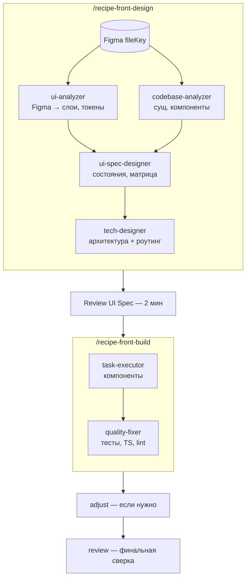

---
tags:
  - note/basic/primary
  - category/webdev
aliases:
  - claude code workflows guide
  - claude-code-workflows
  - workflows plugin
icon: 📝
color: "#70a0b5"
created: 2026-05-29T13:00:00+03:00
updated: 2026-05-29T20:30:53+03:00
---

# Claude Code Workflows — гайд для фронтендера

**Claude Code Workflows** — плагин для Claude Code с формальным процессом разработки: PRD → Design → Plan → Execute → Review. Каждый этап выполняется в свежем контексте агента.

[GitHub](https://github.com/shinpr/claude-code-workflows)

---

## Установка

```bash
# Запустить Claude Code
claude

# Добавить marketplace
/plugin marketplace add shinpr/claude-code-workflows

# Установить фронтенд-плагин
/plugin install dev-workflows-frontend@claude-code-workflows

# Перезагрузить плагины
/reload-plugins
```

| Плагин | Когда ставить |
|--------|---------------|
| `dev-workflows-frontend` | Чистый React/TypeScript фронтенд |
| `dev-workflows-fullstack` | Фронтенд + бэкенд в одном проекте |
| `dev-skills` | Если своя оркестрация, нужны только best practices |

### Опционально

```bash
/plugin install discover@claude-code-workflows   # PRD из идей
/plugin install metronome@claude-code-workflows  # контроль качества
```

---

## Архитектура

```
User Request → requirement-analyzer
    │
    ├─ Small (1-2 файла) → task-executor
    │
    └─ Medium/Large → codebase-analyzer → technical-designer-frontend
                        → quality-fixer-frontend
```

Весь процесс разбит на шаги, каждый в **свежем контексте** — контекст не забивается предыдущими шагами.

---

## Рецепты (команды)

### Дизайн и планирование

```bash
# Создать UI Spec + Design Doc
/recipe-front-design "Страница профиля пользователя"

# Сгенерировать work plan
/recipe-front-plan
```

**Что происходит в `/recipe-front-design`:**
1. `requirement-analyzer` определяет масштаб
2. `ui-analyzer` читает external-resources, дизайн-систему, гайдлайны
3. Вы кладёте прототип в `docs/ui-spec/assets/` (опционально)
4. `ui-spec-designer` создаёт UI Spec — структуру экрана, компоненты, interaction-состояния
5. `technical-designer-frontend` создаёт Design Doc (архитектура компонентов + state management)

UI Spec фиксирует **все состояния** — loading, error, empty, partial — которые прототип обычно не показывает.

### Имплементация

```bash
# Выполнить план
/recipe-front-build

# Быстрая правка без планирования
/recipe-task "Поправить отступы в карточке"
```

`/recipe-front-build` имплементит компоненты с Testing Library, проверяет TypeScript, фиксит линтинг и билд, коммитит по таскам.

### UI-корректировка

```bash
/recipe-front-adjust "Увеличить отступы в Card по макету"
```

1. `ui-analyzer` подтягивает дизайн-источник (Figma, скриншоты) через MCP
2. Предлагает список файлов для правок
3. Цикл: редактирование → MCP-верификация → уточнение
4. `quality-fixer-frontend` прогоняет тесты по изменённым файлам
5. Коммит после каждого блока правок

### Ревью и диагностика

```bash
# Сверить реализацию с Design Doc
/recipe-front-review

# Диагностика бага
/recipe-diagnose "Форма логина не отправляется"
```

**Диагностика:** `investigator` → `verifier` → `solver`. Ищет execution paths, failure points, проверяет покрытие (Devil's Advocate), выдаёт решения с tradeoff-анализом.

---

## Тестирование

| Этап | Что делает |
|------|------------|
| `acceptance-test-generator` | Скелеты E2E/интеграционных тестов из требований |
| `task-executor-frontend` | Пишет компоненты с **Testing Library** (TDD-подход) |
| `quality-fixer-frontend` | Запускает тесты, чинит упавшие, правит типы и линтинг |
| `security-reviewer` | Финальная проверка безопасности |

Качество **встроено в процесс** — каждый executor пишет тесты вместе с кодом.

---

## Структура проекта

```
docs/
├── external-resources.md    # ссылки на Figma, дизайн-систему, API
├── ui-spec/
│   ├── assets/              # прототипы (скриншоты, figma exports)
│   └── profile-page.md      # UI Spec
├── design/
│   └── profile-page-frontend.md   # Design Doc
└── plans/                   # эфемерные файлы — в .gitignore
```

**Коммитить:** `external-resources.md`, `ui-spec/`, `design/`
**`.gitignore`:** `docs/plans/` — удаляется после recipe

---

## Когда какой recipe использовать

| Ситуация | Recipe |
|----------|--------|
| Новая страница/фича | `/recipe-front-design` → `/recipe-front-build` |
| Правка существующего UI | `/recipe-front-adjust` |
| Баг | `/recipe-diagnose` |
| Знаете что делать | `/recipe-task` |
| Проверить реализацию | `/recipe-front-review` |

---

## Важные моменты

- **Design Doc** — ключевой артефакт. Уделите внимание этому шагу.
- **External resources** заполняются один раз через hearing-сессию. Сохраняются в `docs/project-context/external-resources.md`.
- **Прототипы** кладите в `docs/ui-spec/assets/` **до** запуска `/recipe-front-design`.
- **Не ставьте несколько плагинов одновременно** — skills будут дублироваться, Claude Code их проигнорирует.
- Если ошибка осталась после `quality-fixer` — `/recipe-diagnose`.

---

## Сравнение с claude-dev-suite

| | workflows | dev-suite |
|---|---|---|
| Установка | `/plugin marketplace add` | `git clone + ./init-project.sh` |
| Агентов | ~20 (по этапам процесса) | 49+ (по технологиям) |
| Фронтенд | React/TypeScript | React, Vue, Angular, Svelte |
| MCP-серверы | Нет встроенных | 10 шт. |
| Дашборд | Нет | Веб + Electron |
| Процесс | Формальный workflow | Авторутинг по контексту |

Вывод: **workflows** — если нужен предсказуемый воспроизводимый процесс. **dev-suite** — если нужно всё сразу под разные стеки.

## Схема работы


