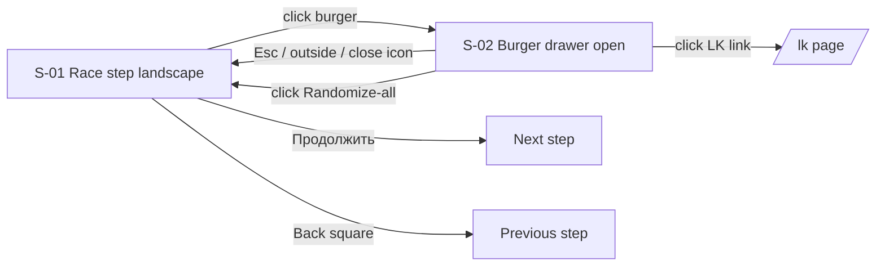

# Landscape Race-Selection Step Redesign UI Specification

## Overview

This UI Specification adapts the existing race-selection step of the character wizard to the new Figma design **for the landscape phone viewport only** (`@custom-variant nlp` = `orientation: landscape AND max-width: 1279px`). The new layout uses a three-zone composition (left race menu, right characteristics panel, top steps navigation) with secondary controls (Randomize-all, RoomInfo, LK link, Help) collapsed behind a right-anchored burger menu. The render path is the existing `RaceStep.tsx` extended with `nlp:*` Tailwind variant overrides; `RaceStepMobile.tsx` is untouched because landscape already routes to `RaceStep` (`code: src/app/(game)/game/character/page.tsx:548`, `dol:flex` gate).

### Target PRD
- PRD path: N/A — based on user requirements (orchestrator hearing 2026-06-02) and codebase/ui analysis output.
- Feature scope: Landscape adaptation of `RaceStep` plus a new shared `CharacterBurgerMenu` component reused on every landscape step at and beyond `race`.

### Design Source
| Source | Path | Version |
|--------|------|---------|
| Figma (canonical) | Figma file `VCzIT4pfiTiXCMAkHrnpS7`, node `1147-18670` | Read via Figma MCP on 2026-06-02 |
| Prototype code | — (no prototype provided) | — |

## Prototype Management

No prototype code is provided for this feature; the Figma node is the canonical visual reference and this document is the canonical specification. The `docs/ui-spec/assets/` directory is intentionally not created.

## External Resources Used

| Resource (project-tier label) | Feature-specific identifier | Notes |
|-------------------------------|-----------------------------|-------|
| Design source — Figma | File `VCzIT4pfiTiXCMAkHrnpS7`, node `1147-18670` (landscape race menu, 812×375) | Burger open-state visuals NOT in Figma — proposed in §"Open Items". |
| Backend API | `GET /api/character-builder/races`, `GET /api/character-builder/subraces` | Already consumed via `useCharacter` → `useCharacterCatalog` (reached via `src/proxy.ts` rewrite to `https://test.dndmaxwell.online` — already configured; no changes for this redesign). No change. |
| Project instructions — AGENTS.md | `AGENTS.md` (sections: structure, color tokens, responsive rules) | Source of truth for tokens, font classes, structural rules. PDF guideline is DEPRECATED. |

## AC Traceability (Prototype)

No prototype exists; AC traceability table is omitted. Requirements are recorded directly in §"Interaction Definition" for each component below, with `req:` markers in lieu of AC IDs.

## Screen List and Transitions

### Screen List

| Screen ID | Screen Name | Description | Entry Condition |
|-----------|------------|-------------|-----------------|
| S-01 | Character wizard — Race step (landscape) | Three-zone composition (left races / right stats / top nav) + burger drawer trigger | `code: page.tsx:548` `dol:flex` branch with `currentStep === 'race'` and viewport matches `nlp` media query (landscape and width ≤ 1279px) |
| S-02 | Burger drawer open | Off-canvas right-anchored drawer with secondary controls | User activates burger trigger on S-01 (or on any subsequent landscape step ≥ race) |

### Transition Conditions

| Source | Destination | Trigger | Guard Condition |
|--------|------------|---------|-----------------|
| S-01 | S-02 | Click / `Enter` / `Space` on burger trigger | `nlp` viewport active; `currentStep` is in `[race, subrace, class, subclass?, origin, alignment, stats, spells]` — same condition as the existing cluster at `code: page.tsx:286,320`. Rationale: `name` and `gender` steps have separate desktop wrappers and predate the cluster; they were never within the cluster's render gate and remain outside the burger's scope. |
| S-02 | S-01 | `Esc`, outside-click, click on close icon, click on drawer-internal action (e.g., LK link triggers navigation) | None |
| S-01 | Next step | `Продолжить` button (preserved from current `CharacterContinueButton` flow, `code:` not modified) | `selection.race` set (current behavior, no change) |
| S-01 | Previous step | Back square (preserved from current back-arrow button, `code:` not modified) | `currentStep` has a predecessor in `allSteps` |



## Component Decomposition

### Component Tree

```
CharacterPage (landscape branch of (game)/game/character/page.tsx)
  +-- CharacterStepsNav (existing, extended)
  |   +-- StepCircle x N (existing internal element)
  |   +-- BurgerTrigger (NEW slot rendered at right end of nav strip)
  +-- RaceStep (existing, extended)
  |   +-- Раса panel (left)
  |   |   +-- Heading "РАСА" + CharacterRandomizeButton (race-only, retained)
  |   |   +-- RaceTileGrid (4 cols in nlp; was 3)
  |   |   |   +-- RaceTile x N
  |   |   |       +-- Hex frame (Vector1 from Figma — likely reuses ClassHalfCircle or new SVG)
  |   |   |       +-- Race icon
  |   |   |       +-- Label
  |   |   |       +-- [selected only] Black overlay (NEW filled variant)
  |   |   +-- Scroll pill (decorative, right edge)
  |   +-- CharacterRightPanel (existing, extended; RoomInfo removed in nlp)
  |       +-- Heading "Характеристики"
  |       +-- Portrait + name + gender chevron row
  |       +-- StatRow x 5 (icon | divider | value | label)
  |       +-- "Особенности" plate
  +-- Bottom controls (existing, unchanged)
  |   +-- Back square (41×41)
  |   +-- Продолжить (teal, wide)
  +-- CharacterBurgerMenu (NEW; portaled drawer)
      +-- Drawer surface (off-canvas right)
      |   +-- Close icon
      |   +-- CharacterRandomizeAllButton (existing component reused, unmodified)
      |   +-- CharacterRoomInfo (existing component reused, unmodified — snapshot cache preserved)
      |   +-- LK link (inline SVG anchor to /lk)
      |   +-- Help item (inline need-help.svg + tooltip; NOT HelpButton component)
      +-- Backdrop
```

### Component: CharacterStepsNav (extended)

Existing component at `code: src/components/sections/character/shared/CharacterStepsNav.tsx:28` — already `nlp`-aware (`nlp:flex-nowrap nlp:overflow-x-auto nlp:w-6 nlp:h-6 nlp:pt-2`). Extension is additive: a right-anchored burger trigger slot.

#### State x Display Matrix

| State | Default | Loading | Empty | Error | Partial |
|-------|---------|---------|-------|-------|---------|
| Display | 9 step circles (or 10 with `subclass`, per `code: page.tsx:175-193` `allSteps` IIFE), each 17×17 in nlp, label `Jost 10px` (`ui:` Figma). Active circle: border `--color-cream-muted` (#FCE9CE), label `--color-cream` (#FFEED5). Completed circle: filled `--color-cream-muted` (proposed; not specified in Figma — see Open Items). Burger trigger rendered after the last circle, vertically centered, icon = 3 stacked horizontal lines, color `--color-cream` (Figma asset name "LightGray"). | N/A (steps are static once `allSteps` resolves) | N/A | If `allSteps` derivation fails (defensive), render circles array empty + still render burger trigger so user can navigate to LK from drawer. | If a step has `disabled` flag (e.g., `subclass` injected later), render its circle dimmed at `opacity-50`. |

#### Interaction Definition

| req: | EARS Condition | User Action | System Response | State Transition | Error Handling |
|------|---------------|-------------|-----------------|-----------------|----------------|
| req:nav-1 | When user clicks a previously-visited step circle | Click | Jump to that step | `currentStep` updates via existing handler (no change) | Disabled circles ignore clicks |
| req:nav-burger-1 | When user clicks the burger trigger | Click / `Enter` / `Space` | Open drawer (S-01 → S-02), set focus to first focusable element in drawer | `burgerOpen = true` | If drawer mount fails, log to console; trigger remains visible |
| req:nav-burger-2 | While drawer is open, when user clicks burger trigger again | Click | Close drawer | `burgerOpen = false` | — |
| req:nav-no-clip | While nav strip is horizontally scrollable on smallest landscape (568×320) | Horizontal scroll | Burger trigger remains visible (sticky at right end of nav strip, not part of scroll) | — | If sticky positioning is unsupported, fall back to a fixed-position trigger anchored to viewport right edge. |

### Component: RaceStep (extended)

Existing component at `code: src/components/sections/character/steps/RaceStep.tsx:35`. Props (`RaceStepProps`) are unchanged. All adaptation is via `nlp:*` Tailwind overrides on existing markup; no new props.

#### State x Display Matrix

| State | Default | Loading | Empty | Error | Partial |
|-------|---------|---------|-------|-------|---------|
| Display | Two-zone layout: left panel "РАСА" (199×324 at Figma reference 812×375, fluid via `cqi`), right panel "Характеристики". Left panel: `bg-card-gradient` (#121212→#272727), Firenight heading `--color-cream` 13.787px, **4-column** race grid (was 3, `code: RaceStep.tsx` `grid-cols-3` must become `nlp:grid-cols-4`). Each tile: hex frame + race icon + label `Jost 8.628px`. Selected tile: Firenight bold label + filled "Black" overlay (`ui:` Group 1147:18866). | While `raceOptions` is empty AND `useCharacterCatalog` reports loading: render 8 skeleton hex tiles (`bg-surface-light/30 animate-pulse`). | If `raceOptions.length === 0` after load: render "Расы не загружены" message + retry CTA wired to `refetch` (existing). | If `useCharacterCatalog` reports error: render error banner inside left panel + retry CTA. | If `raceOptions` partially loaded (rare; only if backend returns truncated list): render whatever is available, no special UI. |

##### Left panel — RaceTileGrid

- Width: clamp(264px, container query, 421px) preserved (`code:` existing cqi sizing).
- Grid: `nlp:grid-cols-4` (Figma reference) overrides existing `grid-cols-3`. Tile aspect ratio preserved; total grid height adjusts.
- Tile selected state requires a **filled variant** of the hex/half-circle SVG (Figma "Black" overlay). `code: src/components/ui/character/ClassHalfCircle.tsx` may need a new `filled` boolean prop, OR a sibling SVG asset can be introduced. Decision deferred to Design Doc (see Open Items TBD-01).
- Scroll: vertical scroll inside left panel; right-edge decorative scroll-pill (`ui:` Figma) reflects scroll position. Pill is purely decorative — actual scroll handled by container `overflow-y: auto`.
- Heading row retains `CharacterRandomizeButton` (race-only random); `CharacterRandomizeAllButton` is **removed** from the left-panel top in `nlp` (moved into burger).

##### Right panel — see CharacterRightPanel below.

#### Interaction Definition

| req: | EARS Condition | User Action | System Response | State Transition | Error Handling |
|------|---------------|-------------|-----------------|-----------------|----------------|
| req:race-1 | When a race tile is clicked | Click / `Enter` / `Space` while tile focused | Call `onSelectRace(option)` (existing handler) | `selection.race` updated; subrace cleared per existing `useCharacter` cascading effect | If selection fails (network), surface toast via existing `ToastContext` |
| req:race-2 | When race-only randomize button is clicked | Click | Call `onRandomize()` (existing) | `selection.race` set to a random option | — |
| req:race-3 | When user opens burger and clicks Randomize-all | (covered in burger interactions) | — | — | — |
| req:race-4 | When `raceOptions` is empty after load | — | Show empty state with retry CTA | Empty state visible | Retry calls `refetch` from `useCharacterCatalog` |

### Component: CharacterRightPanel (extended)

Existing component at `code: src/components/sections/character/shared/CharacterRightPanel.tsx:27`. Already has ~25 `nlp:*` overrides. Two specific changes in this redesign:

1. **Existing embedded `CharacterRoomInfo` mount remains; its `nlp:hidden!` already prevents landscape duplication. New mount added inside `CharacterBurgerMenu`.** The existing source mounts `CharacterRoomInfo` under `md:max-[1660px]:flex nlp:hidden!` — this block stays untouched (the `nlp:hidden!` selector reliably hides it in landscape, so the embedded copy does NOT visually duplicate when the burger surfaces the new mount). A second `CharacterRoomInfo` is mounted as a permanent child of the new `CharacterBurgerMenu` drawer subtree. Because `CharacterRoomInfo` uses a module-cached `useSyncExternalStore` snapshot, two concurrent mounts share the same snapshot and do not cause divergent state.
2. **Recalibrate `--panel-h` clamp** to target ~324px height at Figma reference (812×375). Current clamp value is unknown to this spec — Design Doc must inspect existing CSS and propose the new clamp expression.

#### State x Display Matrix

| State | Default | Loading | Empty | Error | Partial |
|-------|---------|---------|-------|-------|---------|
| Display | `bg-card-gradient`. Heading "Характеристики" Firenight `--color-cream` 12.532px. Portrait + name + gender chevron row. Five stat rows: `[icon | divider | value 00 Firenight 12.821px | label Jost 8.547px]`. Ловкость row carries a star marker (`ui:` Figma). "Особенности" plate below with Оружие / Броня / Навыки bold-labeled lines. | When `useCharacter` `loading` true and selection is empty: render placeholder dashes "—" in stat values; portrait shows neutral silhouette. | When no race+gender chosen, portrait area shows placeholder silhouette (existing behavior). | If portrait image fails to load, fall back to silhouette (existing behavior via `heroImageMap`). | When some traits computed (e.g., race chosen but no subrace), show the partial stat modifiers (existing behavior). |

#### Interaction Definition

| req: | EARS Condition | User Action | System Response | State Transition | Error Handling |
|------|---------------|-------------|-----------------|-----------------|----------------|
| req:right-1 | When user clicks gender chevron in portrait row | Click | Toggle gender between `male` / `female` (existing handler) | `selection.gender` toggled | — |
| req:right-2 | When stat modifier changes due to race/subrace selection | (passive) | Stat value re-rendered with combined modifier from `totalStats` prop | — | — |

### Component: CharacterBurgerMenu (new)

New component at `src/components/sections/character/shared/CharacterBurgerMenu.tsx`. Shared across landscape steps `[race, subrace, class, subclass?, origin, alignment, stats, spells]` — same render gate as the existing cluster at `code: page.tsx:286,320`. The `name` and `gender` steps have separate desktop wrappers that predate the cluster and are intentionally excluded. Replaces that cluster at landscape sizes.

#### State x Display Matrix

| State | Default (closed) | Open | Loading | Empty | Error |
|-------|------------------|------|---------|-------|-------|
| Display | Only the burger trigger is visible (rendered inside `CharacterStepsNav`). Trigger: 3 stacked horizontal lines, color `--color-cream`, hit-target ≥ 24×24px. | Off-canvas drawer slides in from the right (Figma open-state visuals not specified — proposed: `bg-card-gradient` surface, `~280px` wide, full landscape viewport height, decorative SVG border consistent with `MobileStepFrame`). Contents stacked vertically with `--spacing-md` gaps: Close icon (top-right) → `CharacterRandomizeAllButton` → `CharacterRoomInfo` → LK link row → Help item row. Backdrop: `rgba(0,0,0,0.4)`. **`CharacterRoomInfo` mounts as a permanent child of the drawer subtree (rendered even when drawer is closed, hidden via CSS on the drawer surface) so the module-cached `useSyncExternalStore` snapshot is established once on first mount and survives open/close cycles without resubscription.** | If `CharacterRoomInfo`'s snapshot is still resolving (first render), the widget shows its existing internal loading state. Do NOT rewrap with another loader (the module-cached `useSyncExternalStore` snapshot must remain the single source of truth, per `code:` constraint). | If user is not authenticated (no room): `CharacterRoomInfo` renders its own empty state. LK link, Help, Randomize-all remain visible. | If portal target is missing, render drawer inline (without portal) as a non-portaled `position: fixed` overlay — degrades gracefully rather than disabling the trigger. Log warning to console. This preserves LK access on portal failure (consistent with `CharacterStepsNav` Error column which keeps the burger trigger visible). |

#### Interaction Definition

| req: | EARS Condition | User Action | System Response | State Transition | Error Handling |
|------|---------------|-------------|-----------------|-----------------|----------------|
| req:burger-open | When closed and trigger activated | Click / `Enter` / `Space` on trigger | Drawer slides in (animation ~200ms, prefers-reduced-motion = instant). Focus moves to close icon. Body scroll locked. | `burgerOpen: false → true` | — |
| req:burger-close-esc | While open, when `Esc` pressed | `Esc` keydown | Drawer slides out, focus returns to burger trigger | `burgerOpen: true → false` | — |
| req:burger-close-outside | While open, when click outside drawer (on backdrop) | Click | Drawer slides out | `burgerOpen: true → false` | Reuses `nlpHelpRef` outside-click pattern (`code:` existing). |
| req:burger-close-icon | While open, when close icon clicked | Click | Drawer slides out | `burgerOpen: true → false` | — |
| req:burger-randomize-all | While open, when "Случайная генерация" clicked | Click | Invoke `useCharacterRandomizer.randomizeCharacter()` (existing). **Proposed default: drawer closes after randomize-all to surface the new selection; confirm with design owner.** | `burgerOpen → false` (subject to design confirmation); selection cascades via existing `pendingSubRace/SubClass/Spells` refs | If randomizer throws, log + toast via `ToastContext`; drawer remains open. |
| req:burger-roominfo | While open, when user interacts with RoomInfo widget | (delegated) | `CharacterRoomInfo` handles its own interactions (copy room code, copy password, etc., per existing implementation) | — | — |
| req:burger-lk | While open, when user clicks LK link | Click / `Enter` | Navigate to `/lk` (Next.js `<Link href="/lk">`) | Drawer closes implicitly on route change | — |
| req:burger-help | While open, when user hovers / focuses Help icon | Hover / focus | Show tooltip with help text (inline SVG + local listener, NOT the `HelpButton` component). Rationale: `HelpButton` attaches a document-level `mousedown` listener for outside-click closing; mounting two instances (one in the old cluster, one in the drawer) attaches two listeners which cross-fire and break tooltip toggle behavior. The drawer therefore uses an inline SVG + a local listener scoped to the drawer subtree. | — | — |
| req:burger-focus-trap | While open | `Tab` / `Shift+Tab` | Focus cycles within drawer contents only | — | — |
| req:burger-step-persist | When user advances to next step while drawer is open | (defensive) | Drawer auto-closes on step change; burger trigger remains in nav | `burgerOpen → false` | — |

### Requirement Index

Every `req:*` marker used in the interaction tables above, with a one-line summary. Design Doc and Work Plan cite these as AC IDs.

| req: | Component | Summary |
|------|-----------|---------|
| req:nav-1 | CharacterStepsNav | Clicking a previously-visited step circle jumps to that step. |
| req:nav-burger-1 | CharacterStepsNav | Clicking the burger trigger opens the drawer and moves focus to the close icon. |
| req:nav-burger-2 | CharacterStepsNav | Clicking the burger trigger again while open closes the drawer. |
| req:nav-no-clip | CharacterStepsNav | Burger trigger stays in viewport at 568×320 even when nav strip is horizontally scrolled. |
| req:race-1 | RaceStep | Clicking a race tile selects the race; subrace is cleared per cascading effect. |
| req:race-2 | RaceStep | Clicking the race-only randomize button sets a random race. |
| req:race-3 | RaceStep | Cross-reference: Randomize-all is invoked from the burger (see req:burger-randomize-all). |
| req:race-4 | RaceStep | Empty race list shows an empty state with retry CTA. |
| req:right-1 | CharacterRightPanel | Clicking the gender chevron toggles gender. |
| req:right-2 | CharacterRightPanel | Stat values re-render when race / subrace modifiers change. |
| req:burger-open | CharacterBurgerMenu | Activating the trigger opens the drawer with focus on the close icon and body scroll locked. |
| req:burger-close-esc | CharacterBurgerMenu | Esc closes the drawer and returns focus to the trigger. |
| req:burger-close-outside | CharacterBurgerMenu | Backdrop click closes the drawer. |
| req:burger-close-icon | CharacterBurgerMenu | Close icon closes the drawer. |
| req:burger-randomize-all | CharacterBurgerMenu | Randomize-all runs the existing randomizer; drawer closes by proposed default (TBD-10). |
| req:burger-roominfo | CharacterBurgerMenu | RoomInfo internals are delegated to the existing widget. |
| req:burger-lk | CharacterBurgerMenu | LK link navigates to `/lk`. |
| req:burger-help | CharacterBurgerMenu | Help icon shows a tooltip via inline SVG + local listener (NOT `HelpButton`). |
| req:burger-focus-trap | CharacterBurgerMenu | Tab / Shift+Tab cycles focus within the drawer only. |
| req:burger-step-persist | CharacterBurgerMenu | Drawer auto-closes if the current step changes while open. |

## Design Tokens and Component Map

### Environment Constraints

- Target browsers: Chrome / Firefox / Safari / Edge — latest 2 versions (per AGENTS.md non-functional reqs).
- Theme support: Project uses a single dark-themed token set (`--color-deep-bg`, `--color-cream`, etc.). No theme toggle.
- Container queries: race wizard uses `cqi` units inside container scopes (`code:` per AGENTS.md §"Конвенции"). New burger drawer is a portaled overlay → use `vw / vh / px`, not `cqi`.

#### Responsive Behavior

| Breakpoint | Width × Height | Key Changes |
|-----------|----------------|-------------|
| Landscape smallest | 568×320 | Top nav strip horizontally scrollable; burger trigger sticky at right end of nav strip. Left race panel clamps to its `cqi` minimum (~264px). Right panel clamps to its minimum. Drawer width = `min(280px, 80vw)`. |
| Landscape Figma reference | 812×375 | All zones at Figma-specified sizes. Left panel 199 × 324 (px-equivalent at this viewport via `cqi`). Right panel 324px tall. Drawer width = 280px. |
| Landscape upper bound | 1279×500 | Layout still in `nlp` variant. All zones at upper-clamp values (left panel ~421px wide). Drawer width = 280px. |
| Desktop ≥ 1280 | any | `nlp` variant inactive — desktop layout untouched, no behavior change. |
| Portrait phone | any | Routes to `RaceStepMobile.tsx` (embla carousel) — untouched. |

### Existing Component Reuse Map

| UI Element | Decision | Existing Component | Notes |
|------------|----------|-------------------|-------|
| Top steps nav | Extend | `code: components/sections/character/shared/CharacterStepsNav.tsx` | Add burger trigger slot at right end; preserve dynamic `allSteps`. |
| Race step container | Extend | `code: components/sections/character/steps/RaceStep.tsx` | Apply `nlp:*` overrides: `grid-cols-4`, selected-tile filled overlay, remove `CharacterRandomizeAllButton` from heading row. |
| Right stats panel | Extend | `code: components/sections/character/shared/CharacterRightPanel.tsx` | Keep existing embedded `CharacterRoomInfo` mount untouched (already hidden in landscape via `nlp:hidden!`); recalibrate `--panel-h` clamp. |
| Race-only randomize | Reuse | `code: components/ui/character/CharacterRandomizeButton.tsx` | Stays in `Раса` heading row. |
| Randomize-all | Reuse (relocated) | `code: components/ui/character/CharacterRandomizeAllButton.tsx` | Moved from left-panel top to inside burger drawer; component itself unmodified. |
| Room info | Reuse (add new mount) | `code: components/sections/character/shared/CharacterRoomInfo.tsx` | Add a new mount inside `CharacterBurgerMenu` drawer subtree (existing embedded mount in `CharacterRightPanel` is left in place — `nlp:hidden!` prevents landscape duplication). Module-cached `useSyncExternalStore` snapshot is shared by both mounts (do NOT rewrap). |
| LK link | New (inline) | — | Inline SVG anchor inside burger; uses Next.js `<Link href="/lk">`. Not extracted to its own component (single call site). |
| Help icon + tooltip | New (inline) | — | Inline `need-help.svg` + tooltip inside burger with a local listener scoped to the drawer subtree. **NOT** `HelpButton` component: `HelpButton` attaches a document-level `mousedown` listener for outside-click closing; mounting two `HelpButton` instances (e.g., one in the legacy cluster and one in the drawer during a transitional state) attaches two listeners that cross-fire and break tooltip toggle behavior. Inline SVG + local listener avoids this entire class of bug. |
| Hex race tile (filled selected variant) | Extend | `code: components/ui/character/ClassHalfCircle.tsx` (candidate) | Either add `filled` boolean prop or introduce a sibling SVG. Decision deferred to Design Doc (Open Items TBD-01). |
| Burger drawer surface | New | — | `src/components/sections/character/shared/CharacterBurgerMenu.tsx`. No off-canvas precedent in codebase (`code:` per codebase-analyzer). |
| Back square / Продолжить | Reuse | Existing buttons in `RaceStep` / page bottom | Unchanged; z-index preserved at ≥ 100. |
| Existing nlp cluster (`code: page.tsx:285-345`) | Remove | — | Replaced by `CharacterBurgerMenu`. Specifically: the entire `<div ref={nlpHelpRef} className="hidden nlp:flex ...">` block at lines 285-312 AND the `<div className="hidden nlp:flex fixed z-30 right-2 top-2">` block at lines 338-343 are deleted. The `nlpHelpRef` outside-click pattern moves into `CharacterBurgerMenu`. Without this removal, controls would be double-rendered (once in the old cluster, once inside the burger). |

### Design Tokens

#### Color Roles

| Role | Token | Value | Usage |
|------|-------|-------|-------|
| Page background | `--color-deep-bg` | `#020106` | Outer page bg in landscape (Figma frame uses `#181818` — token swap accepted per `ui:` mapping note). |
| Card surface | `bg-card-gradient` | `#121212 → #272727` | Left race panel, right stats panel, burger drawer surface. |
| Card surface (alt) | `--color-page-bg` | `#1a1a1a` | Alternate surface; not used in this redesign but available. |
| Headings | `--color-cream` | `#FFEED5` | Firenight headings: "РАСА", "Характеристики", "Особенности", active step label, selected tile label. |
| Headings (muted accent) | `--color-cream-muted` | `#FCE9CE` | Active step circle border; completed step fill (proposed). |
| Body text | `--color-text-on-dark` | (per `globals.css`) | Tile labels, stat labels. |
| Accent / primary CTA | `--color-accent` | `#66AAA5` | "Продолжить" button background. |
| Border / divider | `--color-divider` + `bg-divider-gradient` | (per `globals.css`) | Stat row dividers. |
| Soft surface (circles) | NO existing token | `rgba(255,255,255,0.10)` | Step circle fill (default). **Proposal:** introduce `--color-surface-soft` = `rgba(255,255,255,0.10)`. See Open Items TBD-02. |
| Soft border (circles) | NO existing token | `rgba(255,255,255,0.20)` | Step circle border (default). **Proposal:** introduce `--color-border-soft` = `rgba(255,255,255,0.20)`. See Open Items TBD-02. |
| Drawer backdrop | NO existing token | `rgba(0,0,0,0.4)` | Burger drawer backdrop. Inline value acceptable; not a reusable token. |

> Old indigo palette (`#6366F1`, `#4F46E5`, `#2563EB`) is forbidden by AGENTS.md and is not introduced anywhere in this spec.

#### Typography Hierarchy

| Role | Font | Size (Figma ref) | Weight | Notes |
|------|------|------------------|--------|-------|
| Heading (panel) | Firenight | 13.787px (РАСА), 12.532px (Характеристики), 12.821px (stat value 00) | Regular | `font-firenight` class. Sizes are container-relative; landscape clamp values in Design Doc. |
| Tile label (default) | Jost | 8.628px | Regular | `font-jost`. |
| Tile label (selected) | Firenight | 8.628px | Bold | `font-firenight font-bold`. |
| Step circle label | Jost | 10px | Regular | `font-jost`. |
| Stat label | Jost | 8.547px | Regular | `font-jost`. |
| Bold inline labels in "Особенности" | Jost | inherited | Bold | Оружие / Броня / Навыки. |

> **Clamp expressions.** Design Doc must derive `clamp()` expressions for all listed font sizes (`13.787px`, `12.532px`, `12.821px`, `8.628px`, `8.547px`, `10px`) so they scale consistently in `cqi` within their container scopes. Draft proposal for tile labels: `clamp(8px, 1.05cqi, 9px)` — Design Doc to validate against the four golden states. See Open Items TBD-09.

#### Spacing Scale

Project does not export explicit spacing tokens; spacing is applied via Tailwind utility classes. For this redesign use:

| Token (Tailwind) | Approx value | Usage |
|------------------|--------------|-------|
| `gap-1` / `gap-2` | 4–8px | Inline tile content, step nav circle gap |
| `gap-3` | 12px | Stat row internal spacing |
| `p-2` / `p-3` | 8–12px | Panel padding, drawer item padding |
| `p-4` | 16px | Drawer outer padding |

#### Elevation (Depth)

| Level | Treatment | Usage |
|-------|-----------|-------|
| 0 | flat | Panels, tiles |
| 1 | subtle inset border (existing decorative SVG borders) | Panel frames |
| 3 | `0 8px 24px rgba(0,0,0,0.45)` | Burger drawer (overlay) |

#### Border Radius Scale

| Token | Value | Usage |
|-------|-------|-------|
| `rounded-full` | full | Step circles, scroll pill, race tile hex (effectively a hex via SVG) |
| `rounded-md` | 6–8px | Burger drawer container, "Продолжить" CTA, back square |

## Visual Acceptance

### Golden States

1. **Race step landscape default (S-01, no race chosen)** — Top nav shows all step circles + burger; left panel shows 4-column hex tile grid, no tile filled; right panel shows placeholder silhouette and "—" stats; "Продолжить" disabled.
2. **Race chosen, drawer closed** — Selected tile shows Firenight bold label + filled Black overlay; right panel shows portrait + applied stat modifiers; "Продолжить" enabled.
3. **Drawer open (S-02)** — Drawer slides in from right; backdrop dims background to ~40%; focus is on close icon; drawer contains, top-to-bottom: close icon, Randomize-all button, RoomInfo widget, LK link, Help item.
4. **Smallest landscape (568×320)** — Top nav strip horizontally scrollable; burger trigger sticky at right; left and right panels respect their `cqi` minimums; no horizontal page scroll on body.

### Layout Constraints

- Left panel width: clamp(264px, container, 421px) preserved from existing implementation.
- Right panel height: clamp targeting ~324px at Figma reference 812×375 (Design Doc to specify exact expression).
- Burger drawer width: `min(280px, 80vw)`.
- Burger drawer z-index: ≥ 110 (above bottom Back/Продолжить cluster at z-100).
- No horizontal body scroll at any supported landscape width.
- Top nav must NOT clip the burger trigger when nav is horizontally scrolled (trigger is sticky at strip's right end).
- No floating top-right control cluster in landscape; secondary controls (Randomize-all, RoomInfo, LK, Help) are reachable only via the burger drawer. The previous `page.tsx:285-345` nlp cluster must not render in any landscape view.

## Accessibility Requirements

### Keyboard Navigation

| Component | Tab Order | Key Binding | Behavior |
|-----------|-----------|-------------|----------|
| Top step circles | 1..N | `Enter` / `Space` | Jump to step (existing behavior). Arrow keys: optional (out of scope, see Open Items TBD-03). |
| Burger trigger | N+1 | `Enter` / `Space` | Open drawer; focus moves to close icon. |
| Race tiles | N+2..N+M | `Enter` / `Space` | Select race. |
| Race randomize button | end of tile group | `Enter` / `Space` | Randomize race only. |
| Right panel gender chevron | next | `Enter` / `Space` | Toggle gender. |
| Back square | next | `Enter` / `Space` | Previous step. |
| Продолжить | next | `Enter` | Advance step. |
| (When drawer open) Close icon | 1 inside trap | `Enter` / `Space` / `Esc` | Close drawer. |
| (When drawer open) Randomize-all | 2 | `Enter` | Randomize all, close drawer. |
| (When drawer open) RoomInfo internals | 3..K | delegated | Copy actions per existing widget. |
| (When drawer open) LK link | next | `Enter` | Navigate to `/lk`. |
| (When drawer open) Help icon | last in trap | `Enter` / focus | Show tooltip. |

### Screen Reader

| Component | Role | Accessible Name | Live Region |
|-----------|------|-----------------|-------------|
| Top nav strip | `nav` | `aria-label="Шаги создания персонажа"` | none |
| Step circle | `button` (existing) | `aria-label="Шаг N: {label}"` + `aria-current="step"` for active | none |
| Burger trigger | `button` | `aria-label="Меню"` + `aria-expanded` reflecting `burgerOpen` + `aria-controls="character-burger-drawer"` | none |
| Burger drawer | `dialog` | `aria-modal="true"` + `aria-label="Дополнительные действия"` | none |
| Drawer close icon | `button` | `aria-label="Закрыть меню"` | none |
| Race tile | `button` (existing) | `aria-label="{race name}"` + `aria-pressed` for selected | none |
| Race randomize | `button` (existing) | `aria-label="Случайная раса"` | none |
| Randomize-all (in drawer) | `button` (existing) | `aria-label="Случайная генерация персонажа"` | none |
| Help icon tooltip | `tooltip` | `aria-label="Помощь"`; tooltip text exposed via `aria-describedby` | polite |
| Toast on error | (existing `ToastContext`) | — | assertive |

### Contrast Requirements

| Element | Foreground | Background | Ratio Target |
|---------|-----------|------------|-------------|
| Tile label default (Jost) | `--color-text-on-dark` | `bg-card-gradient` (#121212–#272727) | 4.5:1 (normal text) |
| Tile label selected (Firenight bold) | `--color-cream` (#FFEED5) | Filled "Black" overlay | 4.5:1 |
| Step circle label | `--color-cream` (#FFEED5) | `--color-deep-bg` (#020106) | 4.5:1 (passes by inspection) |
| Active step circle border | `--color-cream-muted` (#FCE9CE) | `--color-deep-bg` | 3:1 (non-text component) |
| "Продолжить" label | white | `--color-accent` (#66AAA5) | 4.5:1 — **needs verification** (large text 14px Firenight). See Open Items TBD-04. |
| Drawer text | `--color-cream` / `--color-text-on-dark` | `bg-card-gradient` | 4.5:1 |

### Focus-visible

Project currently lacks explicit `:focus-visible` styling. Minimum proposal for this redesign: every focusable element in `nlp` gets an outline `2px solid var(--color-cream-muted)` with `outline-offset: 2px` when `:focus-visible`. Implemented as a Tailwind utility chain on each interactive component listed above.

## Open Items

| ID | Description | Owner | Deadline |
|----|-------------|-------|----------|
| TBD-01 | Confirm whether selected-tile "Black" filled overlay is best implemented by adding a `filled` boolean prop to `ClassHalfCircle` or by introducing a sibling SVG. Decide in Design Doc. | frontend-specialist | before Design Doc finalization |
| TBD-02 | Introduce `--color-surface-soft` (rgba 0.10 white) and `--color-border-soft` (rgba 0.20 white) tokens in `globals.css`, OR keep raw rgba values inline. | technical-designer-frontend | before Design Doc finalization |
| TBD-03 | Arrow-key navigation across step circles is out of scope for this redesign; confirm deferral. | orchestrator | before implementation |
| TBD-04 | Verify contrast ratio of "Продолжить" white-on-`#66AAA5` is ≥ 4.5:1; if not, adjust text color or accent shade. | frontend-specialist | before implementation |
| TBD-05 | Burger open-state visuals (drawer surface treatment, decorative border, slide animation duration) are NOT in Figma. Spec proposes `bg-card-gradient` + MobileStepFrame-consistent border + 200ms slide. Confirm with design owner or accept proposal. | design owner / orchestrator | before implementation |
| TBD-06 | Selected-tile filled variant derived from a single Figma example (Group 1147:18866). Verify the same treatment applies to all races, not only the one inspected. | orchestrator | before implementation |
| TBD-07 | Smallest landscape behavior (568×320) for top-nav sticky burger trigger. Acceptance test: at 568×320 landscape, scroll the step-nav strip to the last circle; the burger trigger must remain in viewport at the right edge with no overlap of step circles. Verify before implementation that the chosen sticky-positioning approach satisfies this test (in a small prototype slice or DOM sketch). | frontend-specialist | before implementation |
| TBD-08 | Completed step circle visual (filled `--color-cream-muted`) is a proposal not specified by Figma; confirm with design owner. | design owner | before implementation |
| TBD-09 | Derive `clamp()` expressions for all Figma-specified font sizes (`13.787px`, `12.532px`, `12.821px`, `8.628px`, `8.547px`, `10px`) so they scale consistently in `cqi` within their container scopes. Draft proposal for tile labels: `clamp(8px, 1.05cqi, 9px)` — validate against the four golden states. | technical-designer-frontend | before Design Doc finalization |
| TBD-10 | Confirm whether the drawer should auto-close after Randomize-all (proposed default in req:burger-randomize-all) — surfaces the new selection but interrupts users who want to re-roll multiple times. | design owner | before implementation |

## Update History

| Date | Version | Changes | Author |
|------|---------|---------|--------|
| 2026-06-02 | 1.0 | Initial version | ui-spec-designer |
| 2026-06-02 | 1.1 | Document-reviewer revisions: fixed S-01→S-02 step list contradiction (I001); resolved CharacterRoomInfo dual-mount wording (I002); added explicit removal row for old nlp cluster page.tsx:285-345 (I004); fixed portal-failure fallback contradiction to render inline overlay instead of disabling trigger (I006); added proxy.ts note (I003); added RoomInfo permanent-mount strategy note (I005); added Requirement Index subsection (I007); clarified Randomize-all UX rationale as proposed default + TBD-10 (I008); replaced vague code: markers for HelpButton with concrete listener-duplication rationale (I009); promoted TBD-07 to before-implementation with concrete 568×320 acceptance test (I010); added typography clamp expressions note + TBD-09 (I011). | ui-spec-designer |
