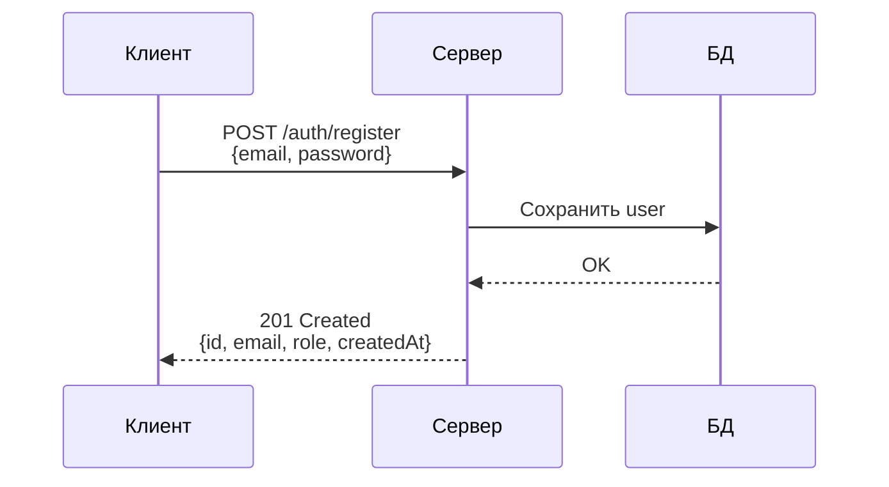
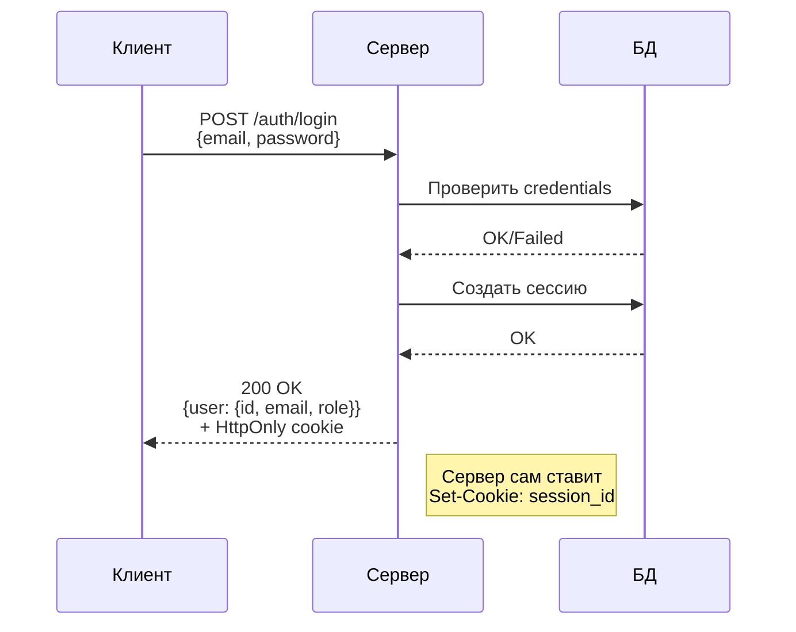
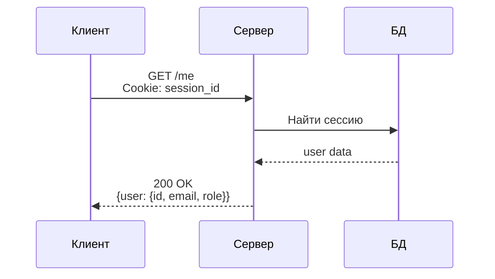
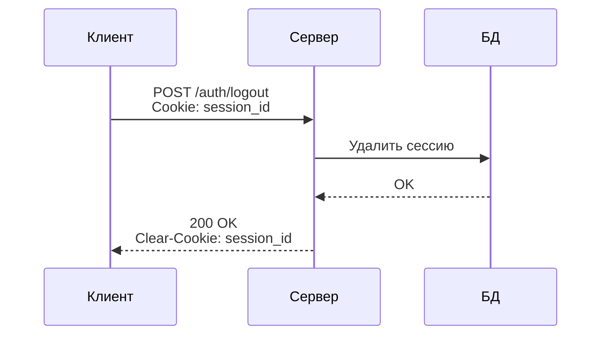
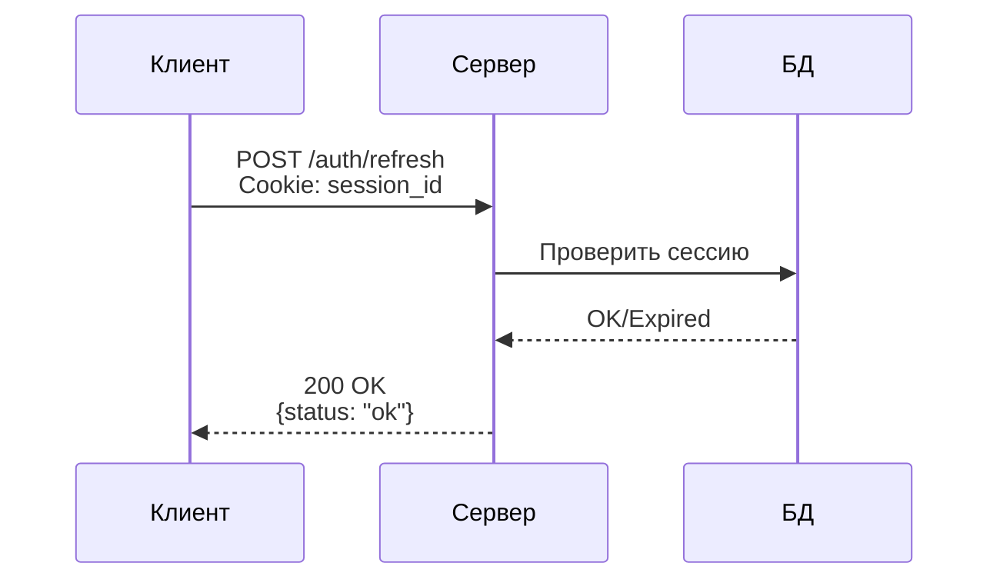

# Схема работы авторизации

## Регистрация

## Логин

## Проверка авторизации (/me)

## Выход (Logout)

## Обновление сессии (Refresh)

## Ключевые требования спецификации

1. **Сервер сам ставит auth-cookies** — клиент НЕ участвует в установке cookie
2. **Не читать токены** — клиент НЕ читает содержимое HttpOnly cookie
3. **Не хранить токены** — клиент НЕ хранит токены в localStorage/sessionStorage
4. **credentials: 'include'** — все запросы отправляют cookies

## Текущая реализация (mock)

Без реальной БД используется in-memory массив `users` для эмуляции хранения пользователей. При подключении реального бэкенда массив заменяется на запросы к БД.
